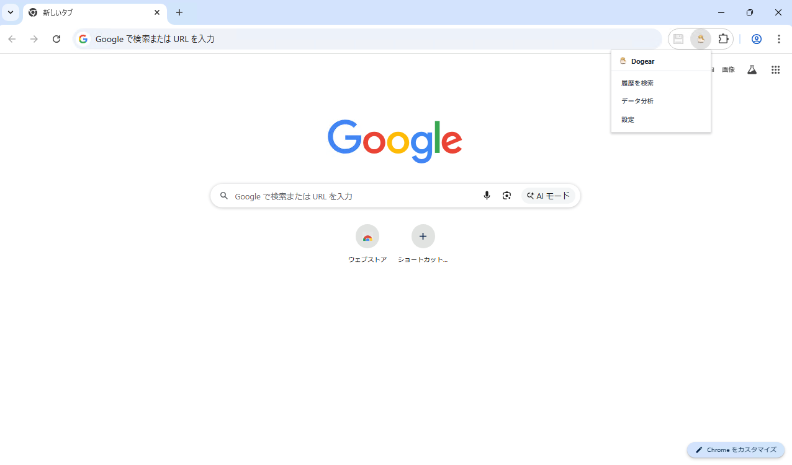
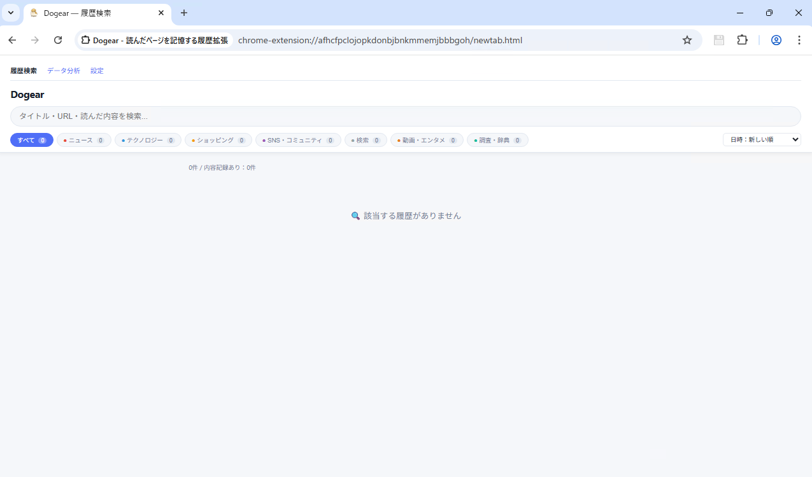
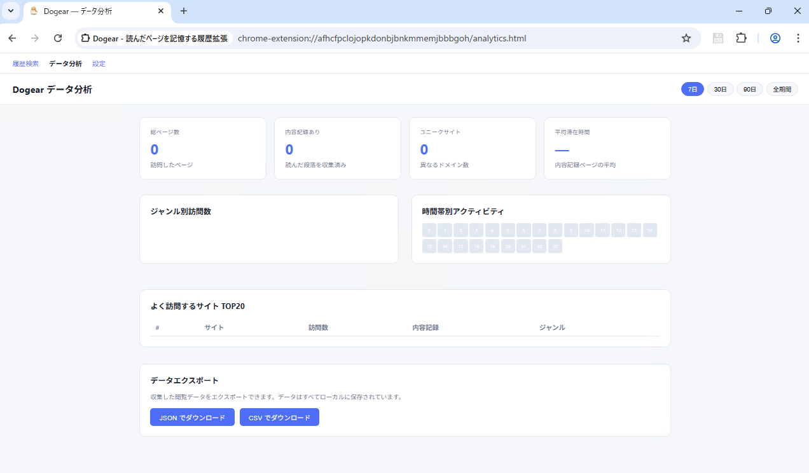
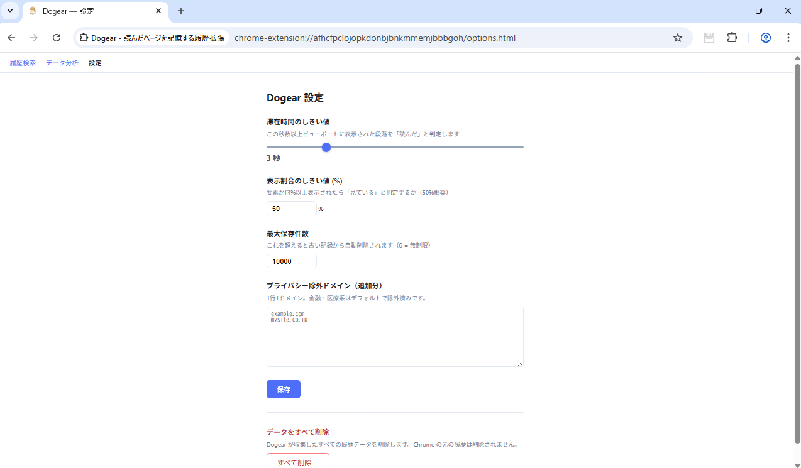

# Dogear — 読んだページを記憶する Chrome 拡張機能

> Chrome の標準履歴はタイトルと URL しか保存しません。**Dogear** は「実際に読んだ段落」を自動検出して記録し、あとから内容で全文検索できるようにします。



## 特徴

- **自動検出** — IntersectionObserver + 滞在タイマーで「本当に読んだ段落」だけを収集。スクロールして通過しただけの要素は記録しません。
- **全文検索** — タイトル・URL だけでなく、読んだ段落テキストでも検索できます。
- **ジャンル分類** — ニュース / テクノロジー / ショッピング / SNS / 検索 / 動画 / 調査 / その他 に自動分類。
- **データ分析** — 期間別 KPI・ジャンル棒グラフ・時間帯ヒートマップ・ドメインランキングを表示。
- **プライバシー設計** — 金融・医療・保険など機密性の高いサイトはデフォルトで除外。追加の除外ドメインも設定可能。
- **完全ローカル** — データは端末上の IndexedDB に保存され、外部サーバーへは一切送信しません。
- **JSON / CSV エクスポート** — 収集データをいつでもエクスポート可能。

## スクリーンショット

| 履歴検索 | データ分析 | 設定 |
|---------|-----------|------|
|  |  |  |

## インストール

### Chrome ウェブストアから（推奨）
[https://chrome.google.com/webstore/detail/xxxx
](https://chromewebstore.google.com/detail/dogear-%E8%AA%AD%E3%82%93%E3%81%A0%E3%83%9A%E3%83%BC%E3%82%B8%E3%82%92%E8%A8%98%E6%86%B6%E3%81%99%E3%82%8B%E5%B1%A5%E6%AD%B4%E6%8B%A1%E5%BC%B5/oihkighmghflioklccacghbonngbefgn?hl=ja&utm_source=ext_sidebar)
### 開発者モードで手動インストール

1. このリポジトリをクローンまたは ZIP でダウンロード
   ```
   git clone https://github.com/tamaglo-studio/dogear-site.git
   ```
2. Chrome で `chrome://extensions/` を開く
3. 右上の「デベロッパーモード」を ON にする
4. 「パッケージ化されていない拡張機能を読み込む」をクリック
5. `Dogear` フォルダを選択

## 使い方

1. 拡張機能をインストールすると Chrome 履歴が自動的にインポートされます
2. Web ページを普通に閲覧するだけで、読んだ段落が自動記録されます
3. ツールバーのアイコンをクリック → 「履歴検索」でキーワード検索
4. 「データ分析」でブラウジングパターンを可視化
5. 「設定」で滞在時間しきい値やプライバシー除外ドメインを調整

## 設定

| 設定項目 | デフォルト | 説明 |
|---------|-----------|------|
| 滞在時間のしきい値 | 3 秒 | この秒数以上表示された段落を「読んだ」と判定 |
| 表示割合のしきい値 | 50% | 要素が何%以上表示されたら「見ている」と判定 |
| 最大保存件数 | 10,000 件 | 超えた場合は古い記録から自動削除（0 = 無制限） |
| 除外ドメイン | （なし） | 1 行 1 ドメインで記録を行わないサイトを追加 |

デフォルトで除外されるサイト：銀行・証券（smbc, mufg, mizuho など）、医療・保険、マイナンバー関連、主要決済サービス

## データの保存について

データは端末のローカル（IndexedDB）に保存されます。利用量に応じて保存容量は増加しますが、設定から削除・管理が可能です。外部サーバーへのデータ送信は一切行いません。

### 容量の目安

| 項目 | サイズ目安 |
|------|----------|
| URL・タイトル・ドメイン・ジャンル | 〜200 B |
| 読んだ段落テキスト（5〜20段落） | 〜2〜5 KB |
| **1件合計** | **約 2〜6 KB** |

- デフォルト（10,000件）で約 **20〜60 MB**
- 無制限設定で長期使用すると **数百 MB** になる可能性があります
- 設定の「最大保存件数」を使って上限を管理することを推奨します

## プライバシーポリシー

- すべてのデータはお使いの端末にのみ保存されます
- 外部サーバーへのデータ送信は行いません
- 金融・医療・保険など機密性の高いサイトはデフォルトで記録除外です

## ファイル構成

```
Dogear/
├── manifest.json       # 拡張機能定義（Manifest V3）
├── content.js          # コンテンツスクリプト（段落検出）
├── background.js       # サービスワーカー（保存・分類）
├── newtab.html/css/js  # 履歴検索ページ
├── analytics.html/css/js # データ分析ページ
├── popup.html/css/js   # ツールバーポップアップ
├── options.html/css/js # 設定ページ
└── icons/              # アイコン（16/48/128px）
```

## 開発・貢献

Pull Request や Issue は歓迎です。

```bash
# リポジトリをクローン
git clone https://github.com/tamaglo-studio/dogear-site.git

# Chrome で読み込み後、ファイルを編集
# chrome://extensions/ で「更新」ボタンをクリックして反映
```

## ライセンス

MIT License — 詳細は [LICENSE](LICENSE) を参照してください。
